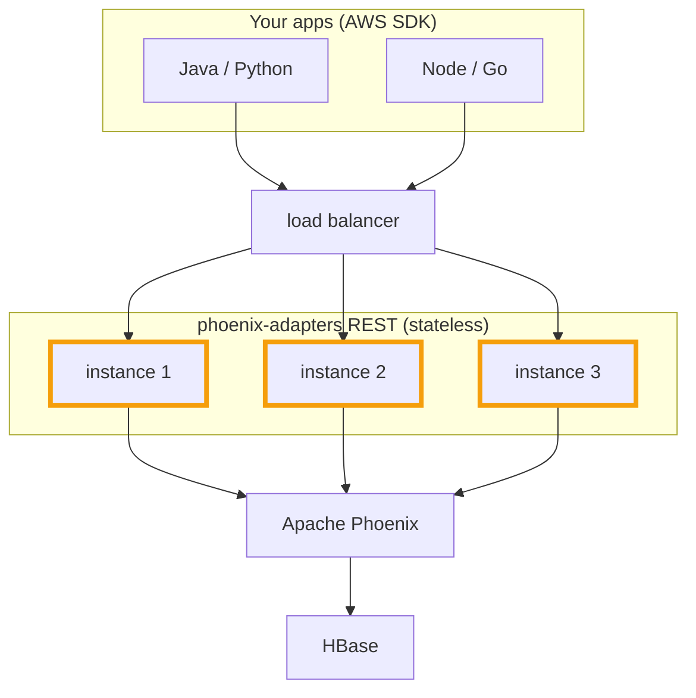

DynamoDB is awesome, until it isn't. Eventually something pushes you to look
elsewhere: a second cloud to support, a bill that keeps climbing, or simply wanting
a different backend. The hard part is not picking the new database. It is the
rewrite: a different client, a different data model, all of your query code redone.

Apache Phoenix on HBase is a seriously capable store: documents, secondary indexes,
TTL, change streams, and more. If it is new to you, this blog walks through it in
three series, [Phoenix Fundamentals](/blog/series/phoenix-fundamentals/) for how it
turns Apache HBase into a SQL database, [Phoenix Features](/blog/series/phoenix-features/)
for some of its core features, and
[Phoenix and DynamoDB Parity](/blog/series/phoenix-dynamodb-parity/) for the
features that make this adapter possible.
[phoenix-adapters](https://github.com/apache/phoenix-adapters) is the piece that
puts a DynamoDB API in front of all of it, so you can keep your existing app and
change exactly one thing: **the endpoint URL**.

## 🏛️ The architecture



The REST process is stateless: all the state lives in HBase. So you run as many
instances as you need behind any load balancer, with no session affinity and no
coordination between them.

## 🧩 Why this is possible now

None of this happened overnight. Over the last year and a half, the Apache Phoenix
community built these DynamoDB-parity features on top of an already deep
foundation. Each DynamoDB concept lands on one of them:

| DynamoDB | Phoenix feature |
| --- | --- |
| Item (document) | [BSON column](/blog/phoenix-dynamodb-parity/bson-document-support/) |
| Condition and update expressions | [BSON expressions](/blog/phoenix-dynamodb-parity/bson-document-support/) |
| Global secondary index | [Eventually consistent index](/blog/phoenix-dynamodb-parity/eventually-consistent-indexes/) |
| DynamoDB Streams | [CDC change stream](/blog/phoenix-dynamodb-parity/cdc-stream-improvements/) |
| Time to live | [Conditional TTL](/blog/phoenix-features/ttl/) |

Closing those gaps is what lets the adapter implement a faithful DynamoDB API
rather than a lookalike. And because the store underneath is a full SQL database, the same
data your DynamoDB calls write is just a Phoenix table, so you can also reach it
with plain SQL whenever you want.

## ✅ Supported APIs

The adapter covers the operations real applications lean on, across DDL, reads,
writes, and streams:

| Group | Operations |
| --- | --- |
| DDL | CreateTable, DeleteTable, DescribeTable, ListTables, UpdateTable, UpdateTimeToLive, DescribeTimeToLive |
| Reads | GetItem, BatchGetItem, Query, Scan |
| Writes | PutItem, UpdateItem, DeleteItem, BatchWriteItem |
| Streams | ListStreams, DescribeStream, GetShardIterator, GetRecords |

The Streams API works with the **DynamoDB Streams Kinesis Adapter** and the
**Kinesis Client Library (KCL) v1**, so existing DynamoDB Streams consumers work
too.

## 🚀 Try it in a few minutes

The repo ships a Docker setup that brings up HBase, Phoenix, and the REST server
together. From a clone of the repo:

```bash
# bring up the full stack and wait until every container is healthy
docker compose -f docker/docker-compose.yml up -d --build --wait

# validate it end to end
bash docker/scripts/smoke.sh
# -> Result: 21 checks PASSED across 18 API calls

# the DynamoDB-compatible endpoint is now at http://localhost:8842
curl -s -X POST http://localhost:8842/ \
  -H 'Content-Type: application/x-amz-json-1.0' \
  -H 'X-Amz-Target: DynamoDB_20120810.ListTables' -d '{}'

# tear it down when you are done
docker compose -f docker/docker-compose.yml down -v
```

Point any AWS SDK at that endpoint and the rest of your code is unchanged. It also
makes a handy little backend when you just want something DynamoDB-shaped behind a
project without standing up the real thing. Spin it up, kick the tires, and let me
know what breaks.

## ⭐ Star the repo

If you try it and it helps, a star on
[apache/phoenix-adapters](https://github.com/apache/phoenix-adapters) goes a long
way. It helps others find the project and signals that this kind of DynamoDB
compatibility is worth investing in.

## 📚 Further reading

- [apache/phoenix-adapters](https://github.com/apache/phoenix-adapters)
- [DynamoDB API reference](https://github.com/apache/phoenix-adapters/blob/main/DDB_API_REFERENCE.md)
