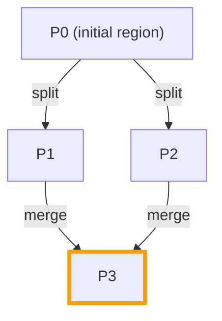

In the features series we covered [change data capture](/blog/phoenix-features/cdc/):
CDC turns a table's inserts, updates, and deletes into an ordered, partitioned
feed, where each partition tracks an HBase region and is read with plain SELECTs.

## The gap

That feed has two rough edges. First, a consumer cannot really see the
partitions: it has no list of them and no sense of how they relate. Second, HBase
regions are not fixed. Under load they split, and later they can merge. So a
partition has a finite life, and the events from a region that split continue in
its children.

A consumer that wants events in causal order needs to know that lineage: it must
drain a parent before the children that descend from it. Otherwise it could read a
child's events before the parent's.

## A stream is just metadata

Phoenix closes both gaps with a stream: a small layer of metadata that tracks the
partitions under a change stream and how they descend from one another. It is not
extra data, just bookkeeping about partitions and their parents.

It is tracked with a familiar tool. When a region splits or merges, HBase invokes
a master-level coprocessor hook. Phoenix hooks in there and records the parent and
child links into a system table, SYSTEM.CDC_STREAM. A split writes one parent to
two children; a merge writes two parents to one child.

Reading SYSTEM.CDC_STREAM shows the same shape. A split gives two rows that share
a parent; a merge gives one child with a row per parent:

| PARTITION_ID | PARENT_PARTITION_ID |
| --- | --- |
| P0 | (none) |
| P1 | P0 |
| P2 | P0 |
| P3 | P1 |
| P3 | P2 |

## Consuming in order

A consumer polls SYSTEM.CDC_STREAM now and then, builds a graph with an edge from
each parent to its children, and topologically sorts it. It starts at the roots
(partitions with no parent) and moves to a partition only once all of its parents
are fully drained.

For the lineage above, that means P0 first, then P1 and P2 in any order, then P3
once both P1 and P2 are done. The highlighted merge is the interesting case: it
has two parents, so it waits for both.

This is the same shard-lineage model as DynamoDB Streams, so a consumer written
for one ports over almost directly.

## Further reading

- [CDC stream lineage](https://phoenix.apache.org/docs/features/change-data-capture#cdc-lineage)
