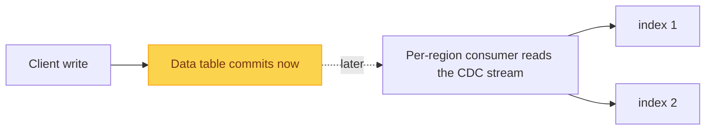
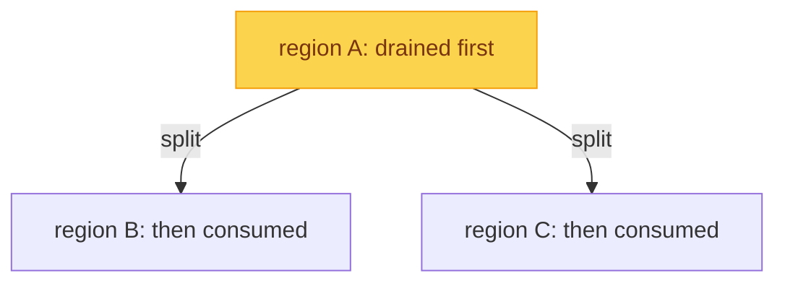

A [secondary index](/blog/phoenix-features/secondary-indexes/) is kept honest on
the write path: a write does not finish until every index has been updated too.
That is what makes reads strongly consistent, but it ties the speed and
availability of your writes to all of your indexes. Add a few large indexes and
every single mutation has more work to do before it can return, and a hiccup on
any one index region slows the write down.

Often you do not need that. If a particular index can lag the data by a moment,
there is no reason to update it inline on every write. An eventually consistent
index accepts that small lag and moves the work off the write path.

## How to create an EC index

You pick the consistency when you create the index:

```sql
CREATE INDEX orders_by_customer
  ON orders (customer)
  CONSISTENCY = EVENTUAL;
```

The default is strong. Nothing else about the index changes.

## How it works

So how does an index stay current without sitting on the write path? With two
tools we have already seen.

When you create an eventually consistent index, Phoenix also sets up a
[CDC stream](/blog/phoenix-dynamodb-parity/cdc-stream-improvements/) on the data
table. A write now only has to commit to the data table itself; the change lands
in the stream, and a per-region background consumer picks it up a moment later and
applies it to the index.



The consumer does not recompute the index entries from scratch. The same
coprocessor that maintains strong indexes computes the index mutations up front,
at write time, and tucks them into the stream. The consumer just replays them, so
it reuses the exact same index-maintenance logic instead of reinterpreting the
change itself.

There is one consumer per region, so the work scales with the table. And since
regions split and merge, the consumer leans on the partition lineage from the last
post: before a region applies its own changes, it finishes whatever its parents
left unprocessed.



That ordering is what keeps the index correct through topology changes.

## Further reading

- [Eventually Consistent Global Indexes](https://phoenix.apache.org/docs/features/eventually-consistent-indexes)
