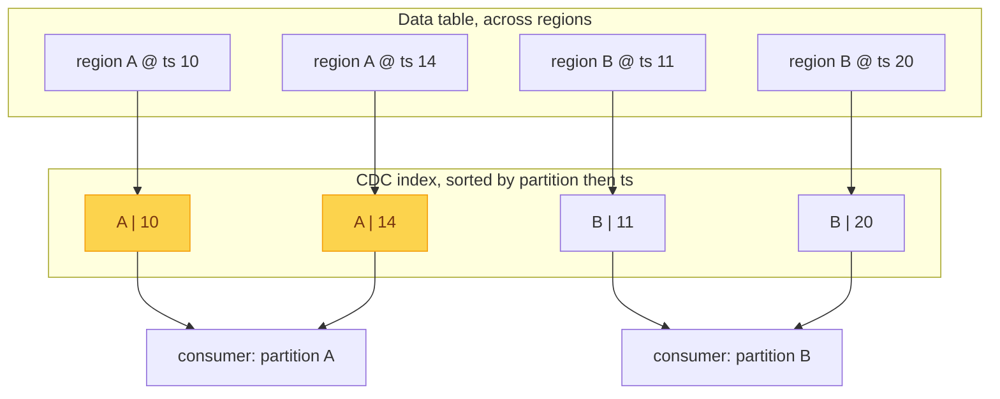

A table tells you the current state of your data. Often you also want the story
of how it got there: every insert, update, and delete, in order. That change
stream is what feeds a data warehouse, keeps a search index or cache in sync, and
triggers downstream workflows.

You could poll the table on a timer, but that is wasteful and misses the
intermediate states between polls. What you really want is an ordered feed of
changes you can subscribe to. That is what Change Data Capture gives you.

## Under the hood: an uncovered index

CDC reuses a feature we already met: the
[uncovered index](/blog/phoenix-features/secondary-indexes/). It has a composite
primary key with two fields:

- the **partition**: which region of the data table the row was written to. This
  groups changes the way Kafka partitions do, so each partition is an
  independently ordered stream.
- the **row timestamp**: when the row last changed. Phoenix exposes this as
  PHOENIX_ROW_TIMESTAMP(), and it is really the timestamp of that empty cell
  from the [fundamentals](/blog/phoenix-fundamentals/phoenix-in-hbase/). Every
  write stamps the empty column, so its timestamp is the row's change time.

Sorted by partition and then timestamp, the index rows become per-partition,
time-ordered change streams. Consumers read one partition each, in order:



Because the index is uncovered, it stays small: it records that a row changed and
when, not the data itself. The before and after values come from the data table's
recent versions when a consumer pulls a change.

## Reading the stream

You never create that index yourself. You define a virtual CDC object, and Phoenix
builds and maintains the index behind it. From there the CDC object behaves like a
table you can query: a consumer needs no special client or API, just ordinary
SELECT queries against the object, filtered to a partition and a time range,
returning ordered change records:

```sql
-- define the change stream once
CREATE CDC orders_cdc ON orders;

-- a consumer reads one partition's changes, in order
SELECT * FROM orders_cdc
WHERE PARTITION_ID() = 'A' AND PHOENIX_ROW_TIMESTAMP() > ?;
```

Each change record carries the row's primary key, so you know which row changed,
and a payload column named "CDC JSON" describing the change. You can ask for the
row image before the change, after it, or just the columns that changed. An order
moving from open to shipped looks like:

```json
{
  "pre":  { "status": "open",    "amount": 99.50 },
  "post": { "status": "shipped", "amount": 99.50 }
}
```

Deletes are captured too, including rows aged out by
[TTL](/blog/phoenix-features/ttl/), so consumers never have to reconcile
retention-driven removals on their own.

Different consumers read different partitions independently, so the stream scales
out the same way the data does.

## Further reading

- [Change Data Capture (CDC)](https://phoenix.apache.org/docs/features/change-data-capture)
- [PHOENIX_ROW_TIMESTAMP()](https://phoenix.apache.org/docs/features/phoenix-row-timestamp)
