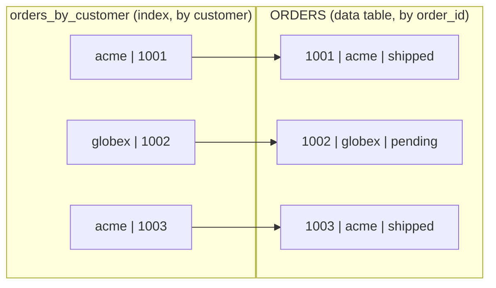
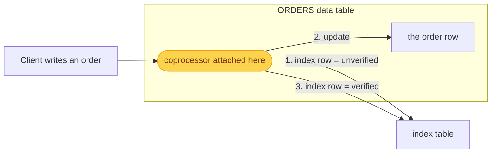
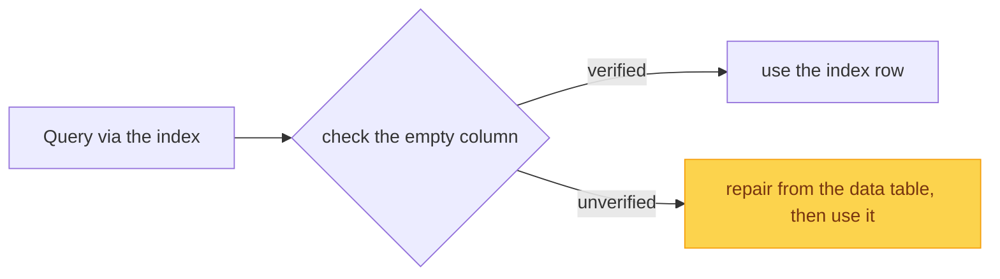

In Series 1 we saw that HBase indexes exactly one thing: the rowkey. So a Phoenix
query on any other column has to scan the whole table. A secondary index fixes
that, letting you look rows up by some other column quickly. The interesting part
is how Phoenix keeps that index correct.

## An index is a separate table

Phoenix implements a secondary index as a separate HBase table, sorted by the
indexed column. Say we want to look orders up by customer:

```sql
CREATE TABLE orders (
  order_id BIGINT NOT NULL PRIMARY KEY,
  customer VARCHAR,
  amount   DECIMAL,
  status   VARCHAR
);

CREATE INDEX orders_by_customer ON orders (customer);
```

The index table's rowkey is the indexed value plus the data table's primary key,
so it is sorted by customer and still maps back to the exact order:



Applications never touch the index table. They query orders as usual, and Phoenix
uses the index behind the scenes.

## Why this is hard

The data table and the index are two separate HBase tables, almost always on
different region servers. Keeping them in sync sounds trivial: on every write,
update both. In a distributed system, it is not.

If the client wrote to both itself, any of these would break it:

- one write succeeds and the other fails, or the client crashes in between, and
  the two tables drift out of sync,
- two updates to the same order race, and the index is left with the wrong entry,
- a reader follows the index to a row that no longer matches, or misses one that
  does.

And every application would have to get this exactly right. So Phoenix does it
centrally, on the server, with a protocol built for failure.

## Enter 2PC and the empty column

Remember the empty cell every Phoenix row carries, from the
[fundamentals](/blog/phoenix-fundamentals/phoenix-in-hbase/)? On index rows,
Phoenix puts it to work. It stores a status there: unverified or verified.

The data table is the source of truth. Index maintenance runs in a coprocessor
attached to the data table: it intercepts every write to orders and keeps the
index table in step, around the data write, in three ordered steps:



This unverified-then-verified status, applied in two steps around the data write,
is essentially a [two-phase commit](https://en.wikipedia.org/wiki/Two-phase_commit_protocol)
on the index row: the first step prepares it, the second commits it once the data
write has succeeded.

Concurrent updates to the same row are serialized with a row lock, so the index
never sees a half-applied state.

What if a crash interrupts the sequence? The data table decides the outcome either
way. A crash after step 1, before the data row is written, leaves an unverified
index row for a change that never committed. A crash after step 2, with the data
row written but not yet marked verified, leaves a committed change whose index row
is still unverified. In both cases you are left with an unverified or stale index
row, which is fine, because of the next piece.

## Read repair

A coprocessor on the index table runs this check on every scan. When a query
lands on an unverified row, it does not trust it. It goes back to the data table,
rebuilds the correct answer, and repairs the index row before returning results:



Because unverified rows only appear after a failure or a race, this happens
rarely, and a read is always consistent with the data table. A background process
sweeps up stale rows over time.

## Covered, uncovered, and partial indexes

Indexes come in a few shapes:

- **Covered:** the index also stores extra columns, so a query that needs only
  those can be answered from the index alone, with no trip to the data table.
- **Uncovered:** the index stores only the indexed column and the primary key, so
  it finds the matching rows and Phoenix reads the rest from the data table.
  Carrying fewer columns makes it smaller and cheaper to keep in sync on writes;
  the tradeoff is that extra lookup at read time.
- **Partial:** the index covers only the rows matching a condition, so if you
  query just a subset, the index stays small and cheap.
- **View index:** an index on a view rather than a table. Phoenix keeps the view
  indexes for all views over the same base table in one shared physical HBase
  table, so the region count stays low even with many views.

## Further reading

- [Secondary Indexes](https://phoenix.apache.org/docs/features/secondary-indexes)
- The design in depth: [Part 1](https://engineering.salesforce.com/the-design-of-strongly-consistent-global-secondary-indexes-in-apache-phoenix-part-1-90b90bda4210/), [Part 2](https://engineering.salesforce.com/the-design-of-strongly-consistent-global-secondary-indexes-in-apache-phoenix-part-2-392c57ec6633/)
