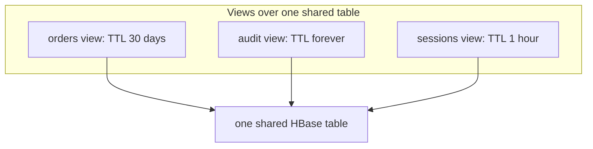

Most data does not live forever. Sessions go stale, logs age out, soft-deleted
records should eventually vanish. Phoenix TTL lets you declare that expiry as a
table property instead of running your own cleanup jobs.

A few things hold across every flavor of it:

- **Expiry is per row.** All of a row's columns expire together, so you never see
  a half-expired row.
- **Any write resets the clock.** An UPSERT to a row re-arms its TTL; there is no
  separate touch operation.
- **Expired rows leave in two stages.** They stop showing up in queries right
  away, and are physically removed later, during major compaction.

The TTL property takes a number of seconds, FOREVER, NONE, or a boolean SQL
expression. Those last two map onto the three granularities below.

## Table-level TTL

The simplest case: one TTL for every row in the table.

```sql
CREATE TABLE events (...) TTL = 604800;  -- one week
```

For a plain numeric TTL like this, Phoenix also copies the value onto the
underlying HBase table, so older clients and non-Phoenix HBase tools see the same
expiry.

## View-level TTL

Recall from the [views post](/blog/phoenix-features/views-and-multi-tenancy/) that
many views can share one physical table. Each of those views can set its own TTL,
so a single table holds data with completely different retention policies:

```sql
CREATE VIEW orders   AS SELECT * FROM shared WHERE kind = 'O' TTL = 2592000; -- 30 days
CREATE VIEW audit    AS SELECT * FROM shared WHERE kind = 'A' TTL = 'FOREVER';
CREATE VIEW sessions AS SELECT * FROM shared WHERE kind = 'S' TTL = 3600;    -- 1 hour
```



At read and compaction time, Phoenix works out which view each row belongs to and
applies that view's TTL. You only set the property; nothing else changes. TTL on
views is allowed only on updatable views, and is gated by a cluster flag.

## Conditional TTL

Sometimes expiry is not a fixed age at all, but a condition on the row itself.
Conditional TTL lets you write that rule as a boolean SQL expression: a row is
expired exactly when the expression is true.

```sql
-- expire a row once it is cancelled
CREATE TABLE orders (...) TTL = 'status = ''CANCELLED''';

-- or give each row its own expiry time
CREATE TABLE orders (...) TTL = 'expires_at < CURRENT_TIME()';
```

With the first rule, expiry simply follows the data:

| order_id | status | TTL says |
| --- | --- | --- |
| 4001 | open | kept |
| 4002 | cancelled | expired |
| 4003 | shipped | kept |

This is closer to DynamoDB-style TTL than to a fixed clock: you decide what
expired means. A few rules come with it. The expression must be boolean and cannot
use aggregates, it is re-evaluated on every read (so CURRENT_TIME() is the query's
time, not the time you wrote the DDL), and you cannot drop a column the expression
references.

## What stands out

A few of these choices are unusual across databases:

- **Conditional TTL.** Most engines expire purely by age. Expressing expiry as an
  arbitrary boolean over the row's own data is rare.
- **Per-view TTL.** Giving different logical views over one shared table their own
  retention is something most engines can only fake by splitting into separate
  tables.
- **Row-grained expiry.** A row expires whole, so you avoid the partial-row
  problem that cell-level expiry can cause, where some columns vanish while the
  rest of the row lingers.

## Further reading

- [TTL](https://phoenix.apache.org/docs/features/ttl)
- [View TTL](https://phoenix.apache.org/docs/features/view-ttl)
- [Conditional TTL](https://phoenix.apache.org/docs/features/conditional-ttl)
