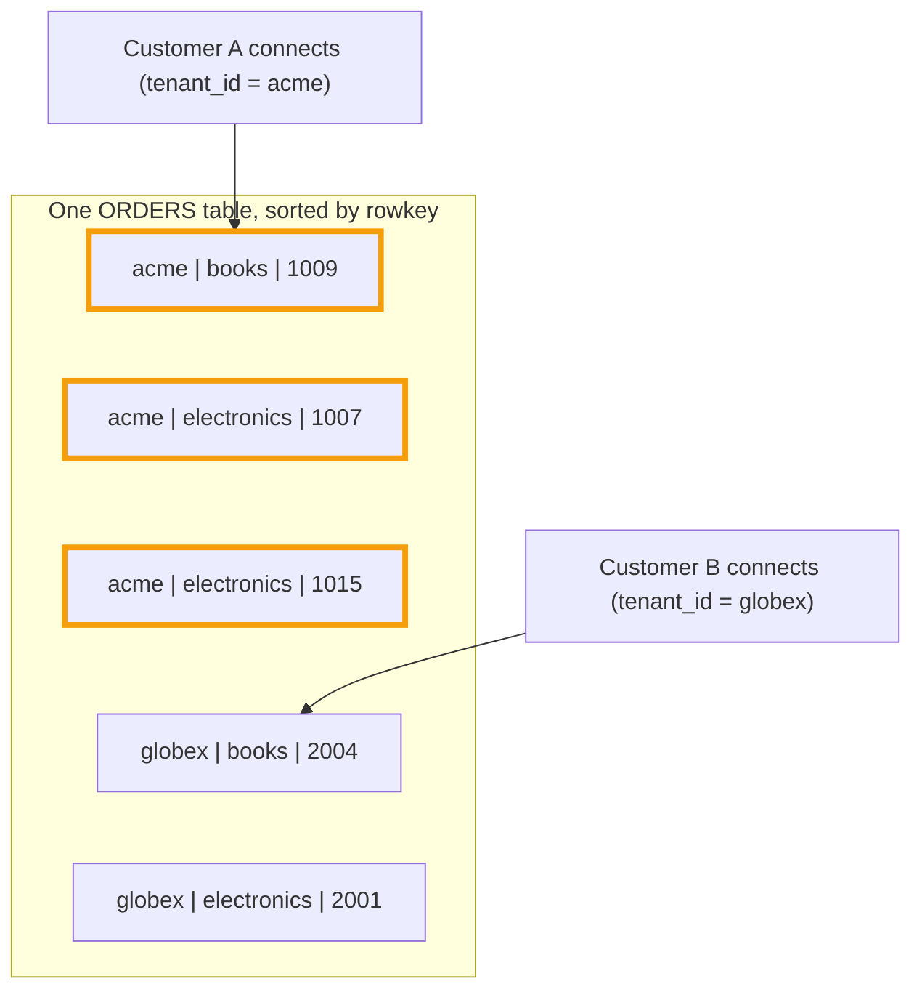
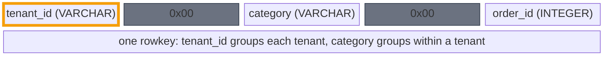

Say you are building an application that stores orders for many customers. Each
customer wants to browse their orders by category, electronics, books, and so on.
And no customer should ever see another's data. That need maps onto two separate
Phoenix features: views, which slice a table, and multi-tenancy, which isolates
customers. Let's take them in turn.

## Views

A view is a virtual table over a physical one: the base table plus a saved WHERE
clause, with no data of its own. A query against the view always applies that
filter. Phoenix also lets a view define extra columns on top of the base table's.

Start with a plain orders table and a view for one category:

```sql
CREATE TABLE orders (
  order_id BIGINT NOT NULL PRIMARY KEY,
  category VARCHAR,
  amount   DECIMAL,
  status   VARCHAR
);

CREATE VIEW electronics AS
  SELECT * FROM orders WHERE category = 'electronics';
```

If a view's filter is simple equality like this, it is updatable: you can UPSERT
and DELETE through it, and Phoenix fills in the filtered column for you. More
complex filters make the view read-only.

## Keeping customers apart

Views slice data, but they do nothing to isolate one customer from another. For
that, Phoenix has multi-tenant tables and tenant-specific connections.

Declare the table with MULTI_TENANT set and make the first primary key column the
tenant id. We also keep category in the key, so a category stays a cheap slice:

```sql
CREATE TABLE orders (
  tenant_id VARCHAR NOT NULL,
  category  VARCHAR NOT NULL,
  order_id  BIGINT  NOT NULL,
  amount    DECIMAL,
  status    VARCHAR,
  CONSTRAINT pk PRIMARY KEY (tenant_id, category, order_id)
) MULTI_TENANT = true;
```

A customer opens a connection with its tenant id set, and isolation becomes
automatic. Phoenix fills in the tenant id on every write, and quietly adds a
tenant filter to every read and delete. A tenant connection can only ever touch
its own rows:



Because the tenant id leads the rowkey, each tenant's data is one contiguous,
isolated block, with category grouping the rows within it:



Tenants can also create their own views on top, to add columns or filters that are
theirs alone.

## One big table, by design

This is the classic SaaS setup: one product, lots of customers, all sharing one
table. It also happens to fit HBase well. The obvious alternative, a table per
customer, does not scale. Every table and region costs you memory and bookkeeping
(MemStores, region assignment, and so on), and that adds up fast once you have
thousands of tenants. HBase would much rather manage a few big tables than a swarm
of tiny ones, which is what this design gives it.

## Further reading

- [Views](https://phoenix.apache.org/docs/features/views)
- [Multi-tenancy](https://phoenix.apache.org/docs/features/multi-tenancy)
