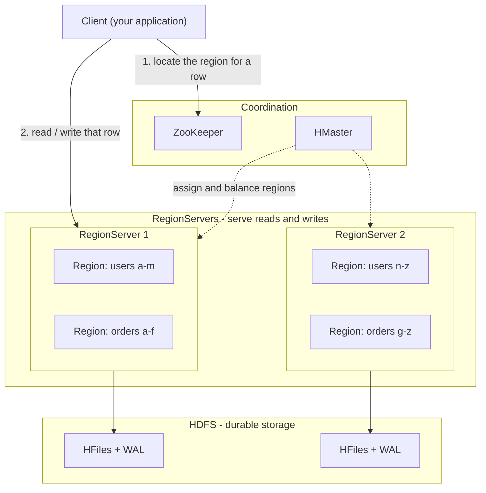
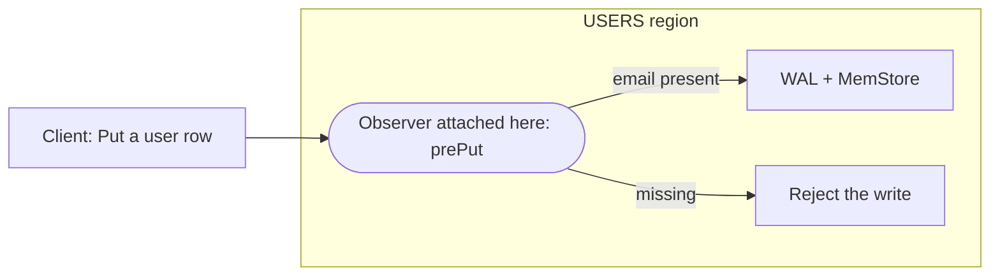
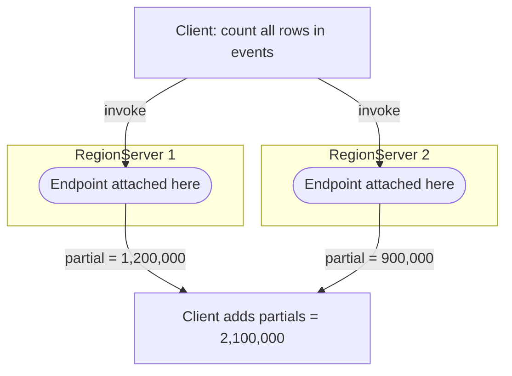

Apache Phoenix is a SQL layer built on top of Apache HBase, so before we talk
about Phoenix we need a shared mental model of the database underneath it. This
post is entirely about HBase. Phoenix shows up again in the next one.

This is **not** a deep dive. HBase is a mature, battle-tested system with a large
open-source community and a wealth of documentation already out there. The
[Apache HBase Reference Guide](https://hbase.apache.org/book.html) and
*HBase: The Definitive Guide* will tell you far more than one blog post ever
could. We will stay deliberately shallow and cover only the parts that matter for
what comes later: the **data model**, the **API**, and **coprocessors**.

## The 10,000-foot view

HBase does not run on one machine. Its pieces are spread across a cluster, each
with a distinct job:

- **ZooKeeper** tracks cluster state and helps clients find the right server.
- **HMaster** is the administrator. It assigns and balances *regions*, but it is
  not on the read/write path.
- **RegionServers** do the real work. A table is split by rowkey range into
  *regions*, and regions are spread across RegionServers, which is how HBase
  scales horizontally. The client talks to RegionServers directly.
- **HDFS** is where the data actually lives (HFiles and the write-ahead log).

That is as far as we will go on topology.

## The data model

An HBase table is a sparse, sorted grid. Every row has a **rowkey** and rows are
kept sorted by it. Columns are grouped into **column families** (here, profile
and activity):

| Row key (sorted) | profile:name | profile:email | activity:clicks |
| --- | --- | --- | --- |
| user#1042 | Asha | asha@corp | 87 |
| user#1043 | Ravi | *(absent)* | 3 |
| user#1044 | Mei | mei@corp | *(absent)* |

A few things are worth remembering:

- **Sorted.** Rows are stored in rowkey order, so scanning a range is fast and a
  random lookup is a quick seek. This shapes all HBase schema design.
- **Sparse.** A cell exists only if it has a value. user#1043 has no email, and
  that costs nothing.
- **Versioned and row-atomic.** Each value is a timestamped cell that can keep
  several versions, and writes to a single row are atomic (across rows, they are
  not).
- **Append-only, like a log.** HBase never edits data in place. New writes are
  appended, and a background compaction process later merges files and drops what
  is obsolete.

## Talking to HBase: the API

HBase gives you a small, low-level API. You operate on rows by key:

- **Get**: read a single row, optionally narrowing to specific families,
  qualifiers, or versions.
- **Put**: insert or update one or more cells in a row.
- **Scan**: read a range of rows in rowkey order, optionally with server-side
  filters.
- **Delete**: does not erase data right away. Because HBase is append-only, a
  delete just writes a *delete marker* (a tombstone), and the data is physically
  removed later, when compaction runs.
- **Increment / Append**: atomic read-modify-write on a cell, handy for counters.

Most applications use the native Java client; REST and Thrift gateways exist for
other languages. Every key and value is just bytes, so HBase itself does not
interpret data types.

That low-level, key-oriented API is powerful but raw. It is exactly why people
want something higher level on top of it, which is where the rest of this series
is headed.

## Coprocessors, the important part

This is the one HBase feature to really understand. A coprocessor lets you run
your own code *inside* HBase, right next to the data. It is the server-side
extension point that turns HBase from a storage engine into a platform, and
almost everything sophisticated built on HBase, Phoenix very much included, is
built out of coprocessors.

What makes them powerful is that they **attach** to HBase rather than sitting in
front of it. You can load a coprocessor:

- on a **single table**, from that table's schema, or
- across the **whole cluster**, from configuration, so it runs everywhere.

And depending on the type, it attaches at the level of a **region**, a
**RegionServer**, the **HMaster**, or the **WAL**. The two kinds you will meet
most often are observers and endpoints.

### 1. Observer, like a trigger

An observer attaches to a region and intercepts operations on it: prePut /
postPut, preGet, preScannerOpen, and so on. It fires automatically whenever the
event happens.

**Write-path example: enforce a simple rule.** Suppose every user row must have a
non-empty email. Instead of trusting every client to check that, a prePut
observer attached to the region rejects any write that breaks the rule, before it
is ever stored:

The rule now lives with the data and applies to every client automatically, no
matter who is writing or from where.

### 2. Endpoint, like a stored procedure

An endpoint also attaches to regions, but instead of intercepting events it is a
custom RPC you invoke on demand. The classic use is server-side aggregation:
rather than shipping rows to the client, you ship the computation to the data.

**Read-path example: count rows in a huge table.** Streaming millions of rows back
just to count them would be wasteful. Instead, an endpoint attached to each region
counts locally and returns a single number; the client just adds them up:

Kilobytes cross the network instead of gigabytes. The recurring theme is
push-down computation, moving code to the data rather than data to the code.

So keep coprocessors front of mind. They are the mechanism that lets a much richer
system be built on top of plain HBase, which is exactly what the next post is
about.

## Up next

Next, we will see how Phoenix puts the SQL back in NoSQL and turns HBase into a
scalable RDBMS.
