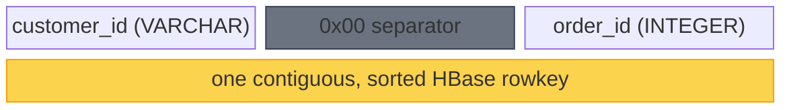
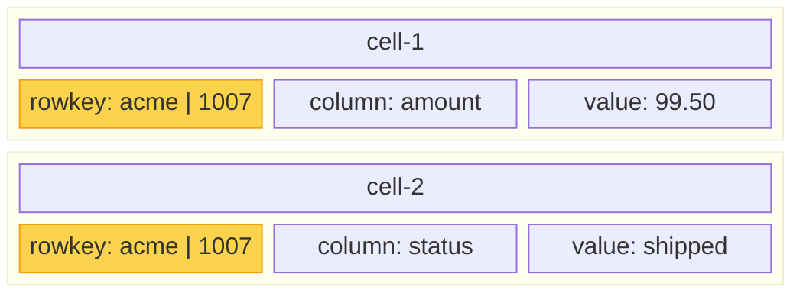
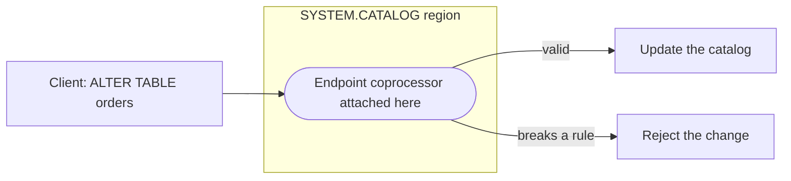

In the [last post](/blog/phoenix-fundamentals/introduction-to-hbase/) we saw that
HBase is a bare, sorted key-value store with a small API and one superpower:
coprocessors. [Apache Phoenix](https://phoenix.apache.org/docs) takes that and
makes it feel like a relational database.

The trick is not a new engine. **Phoenix is really just two things: a client-side
JDBC driver and a set of HBase coprocessors.** Everything else is how those two
pieces map relational concepts onto HBase. This post is that map. We will not go
deep into any single feature yet, and we will save how a query or an upsert
actually runs for the next post.

## Phoenix is not a server

A traditional RDBMS is a process you connect to. Phoenix is not. It is a JDBC
driver on the client plus coprocessors that already live inside HBase. There is
nothing new to run.

| | Traditional RDBMS | Phoenix on HBase |
| --- | --- | --- |
| Where the logic runs | a dedicated database server | a client driver, plus coprocessors inside HBase |
| Where data is stored | its own files | HBase, on top of HDFS |
| What you install | a database | a JDBC jar; coprocessors load into HBase |

## From SQL to HBase

Almost everything Phoenix does is one of these mappings:

| Relational concept | How Phoenix does it on HBase |
| --- | --- |
| Table | An HBase table (rows and column families) |
| Schema and catalog | Stored as rows in the SYSTEM.CATALOG table |
| Primary key | Encoded into the HBase rowkey |
| Columns and data types | Typed values serialized into cells (HBase only sees bytes) |
| Constraints and defaults | Enforced by coprocessors on write |
| Secondary indexes | Extra HBase tables kept in sync by coprocessors |
| TTL, atomic updates, CDC | Built on HBase features and coprocessors |
| SQL queries | Compiled by the driver into Get and Scan calls |

Two of these are worth seeing up close.

## The primary key becomes the rowkey

HBase only has one sorted axis: the rowkey. So Phoenix takes your primary key,
say (customer_id, order_id), and encodes its columns one after another into a
single rowkey. A zero byte follows the variable-length customer_id to separate it
from the order_id. The pieces sit contiguously, and because the whole key is
sorted, all orders for the same customer naturally land next to each other.

That single fact is why primary key design matters so much in Phoenix: the key is
not just an identifier, it is also the physical sort order of your data.

## One row becomes many cells

HBase does not store a row as a single record. Each non-key column is stored as
its own cell, and every cell repeats the full rowkey. So a Phoenix row with two
key columns (customer_id, order_id) and two regular columns (amount, status) is
laid out as one cell per regular column. Each grouped box below is a single HBase
cell: a rowkey, a column, and a value, with the rowkey copied into each.

The rowkey (highlighted) is repeated in every cell, which is why short keys and
short column names keep storage in check.

There is also one more cell we did not draw. Phoenix lets every column be part of
the primary key, but a rowkey on its own is not a cell, and HBase stores only
cells. So Phoenix writes one tiny **empty cell** per row to give it something
after the rowkey. It looks trivial, but it is the lynchpin for a lot of what comes
later, so we will keep referring back to it.

## Your schema is just data

Phoenix stores your schema in an ordinary HBase table, SYSTEM.CATALOG. Tables,
columns, types, and primary keys are just rows:

| TABLE_NAME | COLUMN_NAME | DATA_TYPE | PK position |
| --- | --- | --- | --- |
| ORDERS | CUSTOMER_ID | VARCHAR | 1 |
| ORDERS | ORDER_ID | INTEGER | 2 |
| ORDERS | AMOUNT | DECIMAL | none |

So how do schema changes get validated? When you run CREATE TABLE or ALTER TABLE,
something has to enforce the rules: that a column exists, that the change does not
conflict with existing metadata. Enter coprocessors. An endpoint coprocessor on
SYSTEM.CATALOG runs that logic right where the metadata lives, with no separate
server involved.

And this is only the beginning. Coprocessors are not a one-off for the catalog;
they are how Phoenix does almost everything, and they will keep showing up
everywhere across this series.

## A familiar SQL grammar

Phoenix speaks a broad, mostly standard SQL dialect: SELECT with the usual
clauses, joins, and subqueries. The main
Phoenix-specific twist is UPSERT, one statement that inserts or updates a row. For
the full reference, see the [Phoenix SQL grammar](https://phoenix.apache.org/docs/grammar/).

## Up next

Next, we will follow a query and an upsert from Phoenix SQL all the way down to
HBase and back.
