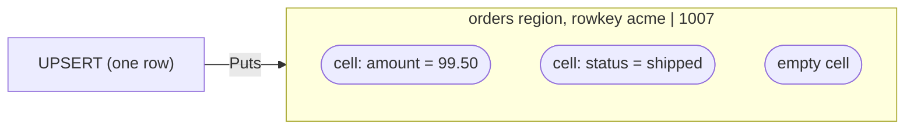
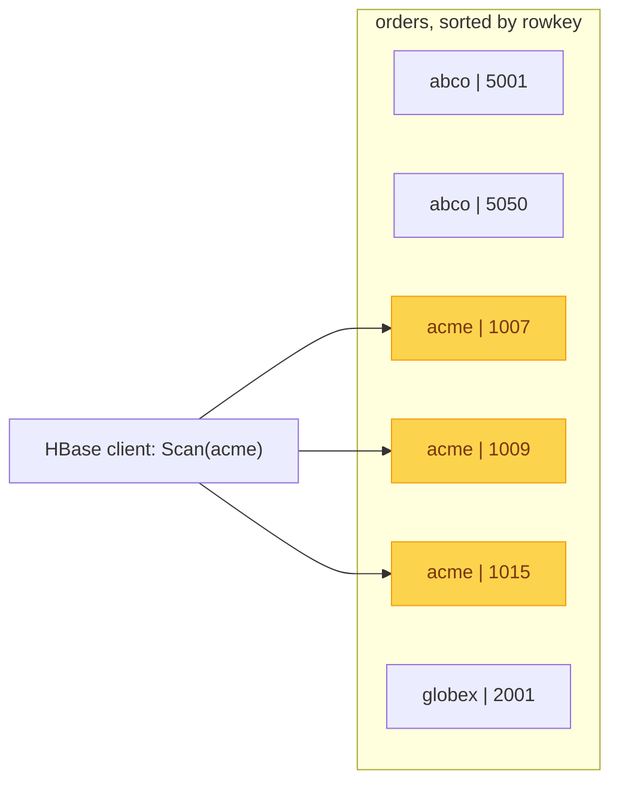
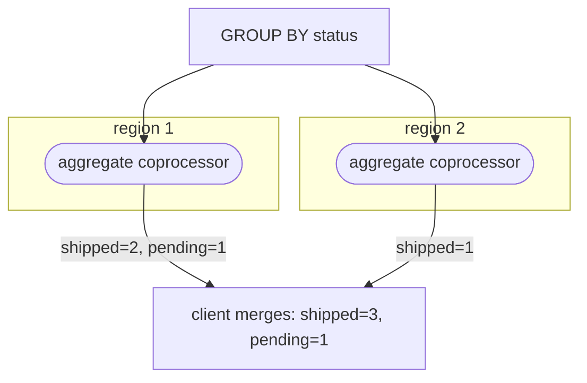

In the [last post](/blog/phoenix-fundamentals/phoenix-in-hbase/) we saw how
Phoenix maps relational concepts onto HBase, with coprocessors doing the work. Now let's put it together and follow three real statements on one table,
from SQL all the way down to HBase and back. On the data path it all bottoms out
in the small HBase API from the first post: Get, Put, and Scan.

## The use case

We will keep using the orders table from the last post:

```sql
CREATE TABLE orders (
  customer_id VARCHAR NOT NULL,
  order_id    INTEGER NOT NULL,
  amount      DECIMAL,
  status      VARCHAR,
  CONSTRAINT pk PRIMARY KEY (customer_id, order_id)
);
```

And a few rows to make things concrete:

| customer_id | order_id | amount | status |
| --- | --- | --- | --- |
| acme | 1007 | 99.50 | shipped |
| acme | 1009 | 12.00 | pending |
| acme | 1015 | 40.00 | shipped |
| globex | 2001 | 5.25 | shipped |

## An UPSERT becomes Puts

```sql
UPSERT INTO orders VALUES ('acme', 1007, 99.50, 'shipped');
```

On the client, the Phoenix driver does the work from the last post: it encodes
the primary key into a rowkey, turns each column into a cell, and adds the empty
cell. Those cells are batched into HBase Put calls, the same write API from the
first post, and sent to the region that owns the rowkey. There is no read first;
Phoenix just writes.



That empty cell from the last post is written here too, so the row exists even
before you think about its columns.

## A SELECT becomes a Scan

```sql
SELECT * FROM orders WHERE customer_id = 'acme';
```

Because the primary key is the physical sort order, every order for acme sits
together. So Phoenix turns this query into a single HBase Scan over a contiguous
rowkey range. The HBase client reads only the highlighted rows:



Other customers' rows sit before and after, but because rows are sorted by
rowkey, acme's orders form one contiguous block. The scan jumps straight to the
first rowkey starting with acme, reads only those rows, and stops; abco and
globex are never touched. If you give the full primary key, customer_id and
order_id, Phoenix can skip the scan entirely and do a single-row HBase Get.

## A GROUP BY runs in a coprocessor

```sql
SELECT status, COUNT(*) FROM orders GROUP BY status;
```

This one could read the whole table, so shipping every row back to the client to
count would be wasteful. Instead, an aggregate coprocessor on each region computes
partial counts locally, and the client merges them:



Only the partial counts cross the network, not the rows. This is the push-down
idea from the first post, now doing real relational work.

## Wrap up

That is it for Phoenix Fundamentals. For more detail than any blog can cover, see
the [Apache Phoenix docs](https://phoenix.apache.org/docs).

A primary key encoded into a rowkey, columns and an empty cell stored as Puts,
range scans that exploit sort order, and coprocessors that compute next to the
data. Put together, that is how Phoenix turns plain HBase into a SQL database.

In the next series, we will cover more advanced features built on top of this
foundation.
